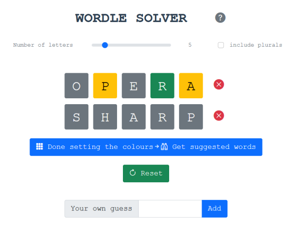

# Web frontend for Wordle-Solver

This is the web-based user interface for [Wordle-Solver](https://github.com/jason-chao/wordle-solver) built on vue.js.  A demo is available at [https://wordle-solver.jasontc.net/](https://wordle-solver.jasontc.net/)



## Project setup
```
npm install
```

### Configures the backend URL

Set environment variable `VUE_APP_WORDLE_SOLVER_API_URL` to point to a backend that your desire.

Create a file named `.env` in the project root.  Add `VUE_APP_WORDLE_SOLVER_API_URL=` followed by the URL of the backend.  See [here](https://cli.vuejs.org/guide/mode-and-env.html#modes) for the details.

### Compiles and hot-reloads for development
```
npm run serve
```

### Compiles and minifies for production
```
npm run build
```
